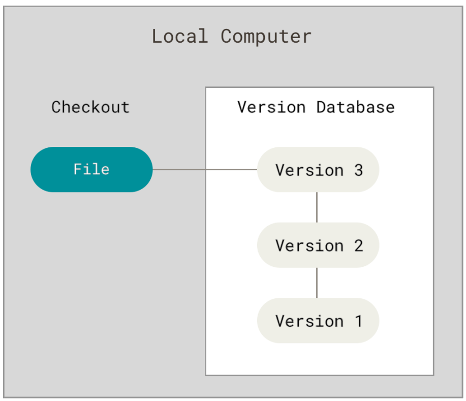

# Git

## Getting Started

**VCSs**: Version Control Systems  
It allows you to revert selected files (even entire project) back to a previous state,and compare changes over time.

- ez to recover



**CVCSs:**  Centralized Version Control Systems


**DVCSs:**  Distributed Version Control Systems


### history

The relationship between Linux community and the company BitKeeper broke down,this prompted the linux development community to develop their own tool.

the goals they set at first:

- speed
- simple design
- strong support for non-linear development (thousands of parallel branches)
- fully distributed
- able to handle large projects like the linux kernel efficiently (speed and data size)

### feature

- Git thinks about its data more like a stream of snapshots

​	*Git Branching*

- Nearly Every Operation is local

​	*Change it locally first, then upload when you could get to network*

- Git has integrity

​	*Use a hash set (SHA-1) to detect changes*

- Git Generally Only add data

​	*Safe to try everything for you could undo everything*

- The three states
  - modified
  - staged
  - committed

The basic Git workflow goes something like this:

1. modify a file in your working tree
2. selectively stage just those you want to commit, which adds the changes to the staging area
3. A commit happens, the files in the staging area would store as a snapshot permanently to your Git directory

### Command Line

use Git on the command line  

1. **First-Time Git Setup**

​	view all of your settings and where they are coming form using

```bash
$ git config --list --show-origin
```

2. **Make some settings**

```bash
$ git config --global user.name "xxxx"
$ git config --global user.email xxxxx@xx.com
```

**Set your default branch name as "main"!**

```bash
$ git config --global init.defaultBranch mian
```


## Git Basics

### Getting a Git Repository

Use `git init` to creates a new subdirectory named *.git* that contains all of your necessary repository files --a Git repository skeleton. At this point, nothing in your project is tracked yet.

### Git add

Use this command to tracking New Files 

and also could stage the tracked files which has been modified

also could marking merge-conflicted files as resolved

### Git commit

It would invoke your shell editor and you may see:
```vim
# Please enter the commit message for your changes. Lines starting
# with '#' will be ignored, and an empty message aborts the commit.
#
# On branch main
# Changes to be committed:
#       modified:   gitlearning/GitLearning.md
#
~       
~  .git/COMMIT_EDITMSG [unix] (10:12 11/09/2024)                                1,0-1 All
```

you can also use 
```bash
git commit -m "Some description of this commit"
```
if you still want to do a simple shortcut, try to use the command `commit -a` 

This is convenient, but be careful;sometimes this flag will cause you include unwanted changes

### Git rm
 
*Remove a file from your staging area*    

- If you just simply remove the file from your working directory, it shows up under the "Changes not stages for commit"   
- Then, if you run `git rm`, it stages the file's removal  
- The next time you commit, the file will be gone and no longer tracked.  
- If you modified the file or had already added it to the staging area 

**`git rm --f`**
This is a very dangerous command which it could remove your file physically.  
JUST DELETE IT!

**`git rm --cached`**  
This is also a useful tool for you to remove a file from the staging area

### Moving files
**`git mv file_from file_to`**  
which is equivalent to running something like this :
```
mv file_from file_to
git rm file_from
git add file_to
```
### View the Commit History

Use `git log`  
It has many options to try

### Undoing Things

#### **Appending**  
`git commit --amend`

Be used for when you forget something to commit while you dont want to commit it twice.  
- Like this
```
git commit -m "Initial commit"
git add forgotten_file
git commit --amend
```
then the second commit replaces the results of the first.  
--end up with a single commit.

#### **Unstaging a staged file**  
`git restore --staged <file>`

#### **Unmodifying a Modified file**  
`git restore <file>`  
**! ! ! It is important to understand that `git restore <file>` is dangerous ! ! !**  
*Any changes you made to that file are gone--back to the last staged or commit version*
### Working with Remotes
To collaborate on any Git project
